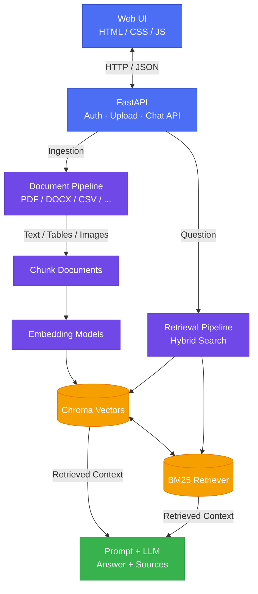
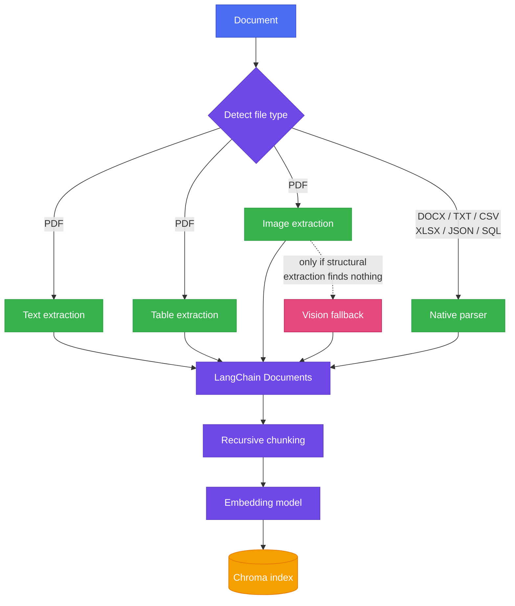
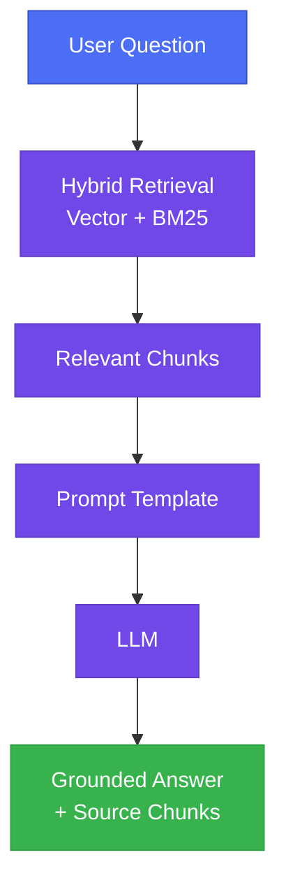
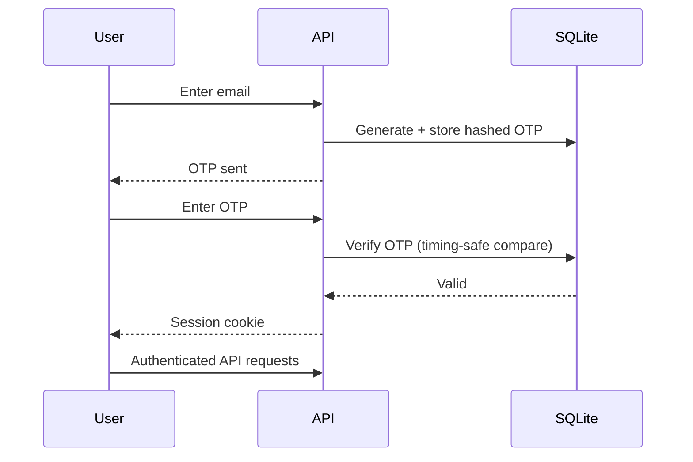

# Document Portal

Document Portal is a RAG system that turns any document — PDF, DOCX, spreadsheet, or a SQL database — into something you can actually ask questions about. It treats ingestion as the hard part worth getting right: tables and charts that don't parse cleanly, provider lock-in, and retrieval that quietly returns wrong answers are all handled explicitly instead of assumed away.

**[Live Demo](#)** — deployed on Render. Auth uses SQLite; vectors persist to a Chroma store on disk.

## Why Document Portal exists

Most RAG tutorials assume a clean PDF with normal tables and no images. Real documents aren't like that — academic papers have borderless tables and vector-drawn charts, spreadsheets have merged cells, and a lot of useful information lives in a table row or a chart, not a paragraph. I wanted to build something that handled that mess honestly: try the fast, free extraction method first, and only fall back to something expensive (a vision model reading the whole page) when the fast method actually fails — verified against a real academic paper, not just a synthetic test file.

## What it does

- Ingests PDF, DOCX, TXT, MD, CSV, JSON, XLSX, and any SQL database through one entry point
- Extracts tables and images from PDFs, with a vision-model fallback for borderless tables and vector-drawn charts that structural parsing misses
- Chunks, embeds, and indexes everything into a vector store, tagged by content type (text/table/image)
- Retrieves using hybrid search (vector + BM25 keyword), auto-weighted per document based on how jargon-heavy the content is
- Answers questions grounded in retrieved context, with sources shown alongside the answer
- Supports OTP-based login (no passwords stored)

## Architecture

### High-level system



### Ingestion pipeline



### Retrieval (RAG)



### Authentication



## Engineering decisions

- **Cascading extraction, not always-vision**: structural methods (pdfplumber, PyMuPDF) run first because they're fast and free. Vision fallback only triggers when structural extraction finds nothing on a page that demonstrably has visual content — avoids paying for an LLM call on every page when most pages don't need it.
- **Provider registry, not a hardcoded LLM**: embeddings and chat models are both pluggable — HuggingFace, OpenAI, Google, Cohere, Anthropic. Adding a new provider is one function and one registry line, not a rewrite.
- **Embedding/vector-store consistency is enforced, not assumed**: querying a store with a different embedding model than the one that built it silently returns meaningless similarity scores. A sidecar metadata file records what built the store and validates against it at query time — fails loudly instead of failing silently.
- **Hybrid search over pure vector search**: embeddings blur exact terms — IDs, citations, technical jargon — that keyword search catches directly. The balance between the two is auto-tuned per document using a lexical-diversity heuristic, not fixed.
- **DeepEval gated behind explicit opt-in**: judge-model calls cost real API credits, so the RAG-quality suite doesn't run on every commit — only when deliberately triggered (pre-push locally, or in CI with a configured key).

## Stack

- FastAPI backend, deployed on Render
- HTML/CSS/JS frontend (no framework)
- LangChain for chunking, prompts, and caching; Chroma for vectors; BM25 for keyword search
- pdfplumber and PyMuPDF for structural extraction; Gemini for vision fallback and image captioning
- SQLite for auth; Chroma persisted to disk for vectors
- pytest (28 tests) and DeepEval (10-case RAG quality suite)
- GitHub Actions and pre-commit hooks for CI

## Run locally

```
git clone <your-repo-url>
cd document-portal
python -m venv .venv
.venv\Scripts\Activate.ps1
pip install -e ".[dev]"
```

Create `.env` with your keys:

```
ANTHROPIC_API_KEY=
GOOGLE_API_KEY=
ADMIN_EMAIL=
SESSION_SECRET=
OTP_DEBUG=true
```

Run it:

```
uvicorn api.main:app --reload --host 127.0.0.1 --port 8000
```

Open http://127.0.0.1:8000.

## Validate

```
pytest tests -v
```

Run the paid RAG-quality suite (requires `GOOGLE_API_KEY`):

```
python scripts/run_deepeval.py
```

## Known limitations

- Vision fallback for undetected tables/charts is PDF-only — DOCX extraction is structural-only
- No automatic retry on LLM rate limits — fails gracefully, doesn't auto-retry
- Hybrid search weighting is a heuristic, not a tuned model
- Free-tier vector store persistence may be ephemeral on some hosts (Render free tier) — a redeploy can require re-indexing

## License

MIT License — see [LICENSE](LICENSE) for details.