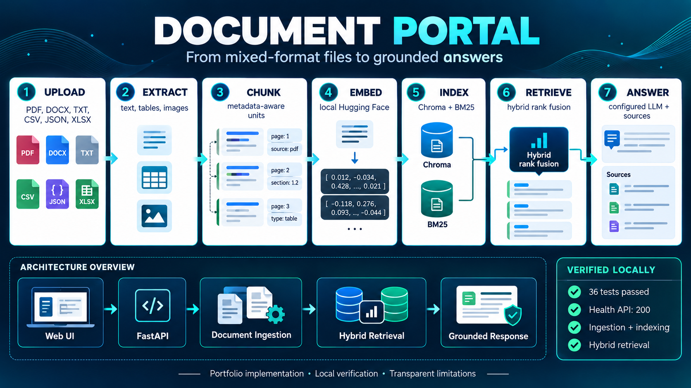
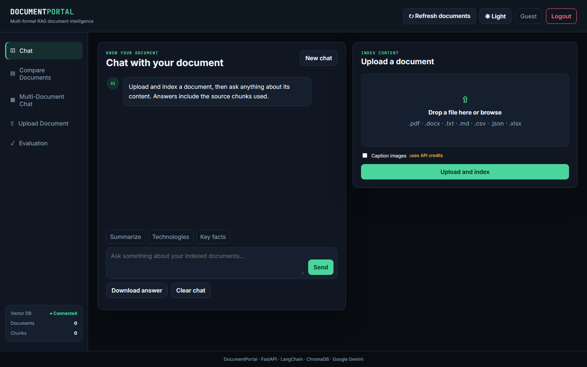
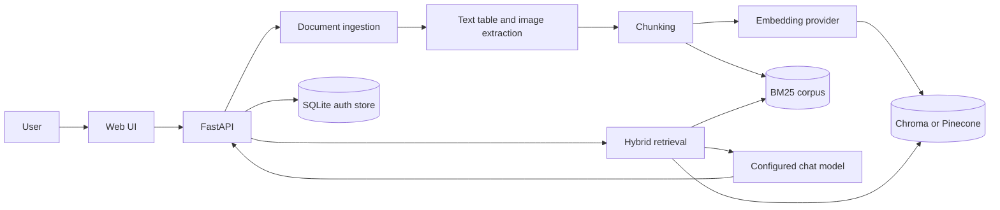

# Document Portal

[](https://github.com/Narang-Garima/document-portal/actions/workflows/ci.yml)
[](https://www.python.org/)
[](https://fastapi.tiangolo.com/)

Document Portal is a portfolio RAG application for turning mixed-format documents into searchable knowledge. It combines document ingestion, mixed-content extraction, hybrid retrieval, grounded question answering, document comparison, optional access control, and an API-backed web interface.

The project focuses on the engineering problems that appear after a basic RAG demo: heterogeneous file formats, tables and images, embedding consistency, exact-term retrieval, provider portability, testability, and transparent limitations.



## Application interface



## What I built

- A FastAPI application with upload, chat, multi-document chat, comparison, evaluation-status, user-administration, and health endpoints
- One ingestion entry point for PDF, DOCX, TXT, Markdown, CSV, JSON, and XLSX files
- A separate SQLAlchemy loader for relational database tables
- Structural PDF extraction with `pdfplumber` and PyMuPDF, plus an optional Gemini vision fallback for missed visual content
- Recursive text chunking while preserving table rows and image descriptions as self-contained retrieval units
- Local Chroma or optional Pinecone vector storage with embedding-provider metadata validation
- Hybrid retrieval that combines vector search with BM25 using weighted reciprocal-rank fusion
- Grounded answer generation with the retrieved source chunks returned to the UI
- SQLite-backed users and hashed, expiring, single-use OTP codes when authentication is enabled
- Unit and API tests, Ruff checks, pre-commit hooks, Docker packaging, and GitHub Actions

## Architecture



### Request flow

1. A user uploads one or more supported files.
2. The dispatcher selects the appropriate loader and extracts text and structured content.
3. The application chunks the content and records its source/type metadata.
4. The configured embedding model indexes dense vectors in Chroma or an existing Pinecone index.
5. Raw chunks are retained locally for BM25 keyword retrieval.
6. Vector and keyword rankings are merged, then passed to the configured chat model.
7. The API returns the grounded answer and the source chunks used to produce it.

## Engineering decisions

### Cascading extraction

Structural extraction runs first because it is faster and does not require a model call. The Gemini vision fallback is optional and is used only when structural parsing misses visual content on a PDF page.

### Embedding consistency

The application records which embedding provider and model created a vector store. Query-time validation rejects a mismatched configuration instead of silently comparing incompatible vectors.

### Hybrid retrieval

Dense retrieval captures semantic similarity, while BM25 preserves exact terminology such as identifiers, citations, and domain-specific terms. The application merges both rankings with weighted reciprocal-rank fusion.

### Provider portability

Provider registries isolate model construction from the retrieval pipeline. The implemented integrations support Hugging Face, OpenAI, Google, and Cohere embeddings, plus Anthropic, OpenAI, and Google chat models.

## Repository structure

```text
document-portal/
├── api/                     FastAPI application and routes
├── config/                  Model, chunking, storage, and app settings
├── docs/                    Verified screenshot and validation notes
├── evals/                   Opt-in DeepEval RAG quality suite
├── scripts/                 Evaluation and vector-store inspection utilities
├── src/
│   ├── document_analyzer/   PDF and DOCX mixed-content extraction
│   ├── document_chat/       Chunking, indexing, retrieval, and generation
│   ├── document_compare/    Deterministic document comparison
│   └── document_ingestion/  File and SQL loaders
├── static/                  Browser JavaScript and CSS
├── templates/               Jinja UI templates
├── tests/                   Unit and API tests with local fixtures
├── Dockerfile
├── pyproject.toml
└── README.md
```

## Local setup

Python 3.11 is recommended.

```powershell
git clone https://github.com/Narang-Garima/document-portal.git
cd document-portal
python -m venv .venv
.venv\Scripts\Activate.ps1
python -m pip install --upgrade pip
pip install -e ".[dev]"
Copy-Item .env.example .env
```

The UI and health endpoint can start without a model key. Document question answering requires the API key for the chat provider selected by `LLM_PROVIDER` or, when that variable is unset, by `config/config.yaml`. The default embedding provider is the local Hugging Face model.

Start the application:

```powershell
uvicorn api.main:app --reload --host 127.0.0.1 --port 8000
```

Open `http://127.0.0.1:8000`.

### Optional authentication

Authentication is disabled in `.env.example` for the shortest local demo path. To enable it:

```dotenv
AUTH_ENABLED=true
SESSION_SECRET=replace-with-a-long-random-secret
ADMIN_EMAIL=your-email@example.com
```

Configure SMTP for email delivery. `OTP_DEBUG=true` displays the code for local testing only and should not be used for a deployed environment.

### Optional Pinecone backend

Create an index whose dimension matches the configured embedding model, then install the optional integration:

```powershell
pip install -e ".[dev,pinecone]"
$env:VECTOR_STORE_PROVIDER="pinecone"
$env:PINECONE_API_KEY="..."
$env:PINECONE_INDEX_NAME="document-portal"
$env:PINECONE_NAMESPACE="default"
```

The current hybrid implementation still stores raw chunks locally to construct the BM25 index.

## Validation

```powershell
python -m pytest -q
python -m ruff check .
python -m ruff format --check .
```

Latest verified local result on October 5, 2026:

- `36 passed` with Python 3.11.6
- Ruff lint completed with no findings
- Ruff formatting check confirmed 38 formatted files
- `/health` returned HTTP 200 with version `0.1.0`
- The application home page and static assets loaded successfully
- A real text document was extracted and indexed into Chroma and the BM25 corpus
- Hybrid retrieval returned the correct source chunk with an automatically selected vector weight of `0.3`

See [`docs/verification.md`](docs/verification.md) for the exact scope and limitations of this validation.

### Optional DeepEval suite

The repository includes a ten-case DeepEval suite for answer relevancy, faithfulness, and contextual relevancy. It is deliberately opt-in because it calls a paid judge model.

```powershell
pip install -e ".[dev,eval]"
$env:RUN_RAG_EVALS="1"
python scripts/run_deepeval.py
```

No DeepEval scores are claimed in this README because the paid suite was not executed during the latest local verification.

## Current limitations

- Local extraction, Chroma indexing, and hybrid retrieval were verified end to end. Final model generation still requires a valid provider credential; the credentials available during verification were rejected by both configured providers with HTTP 401 responses.
- Vision fallback is implemented for PDFs; DOCX visual extraction remains structural-only.
- LLM calls fail cleanly but do not currently implement retry/backoff for rate limits.
- Hybrid weighting is heuristic rather than learned or benchmark-tuned.
- Pinecone dense vectors still require shared durable storage for the local BM25 corpus in a multi-instance deployment.
- Authentication does not replace enterprise identity, document-level authorization, rate limiting, or centralized audit logging.
- The included Dockerfile and CI workflow are repository assets; this project does not claim a verified production deployment or enterprise-scale load test.

## Project scope

This is a local portfolio implementation. It demonstrates an end-to-end document intelligence workflow and tested application components without claiming production traffic, enterprise scale, or a live cloud deployment.

## License

MIT License. See [`LICENSE`](LICENSE).
