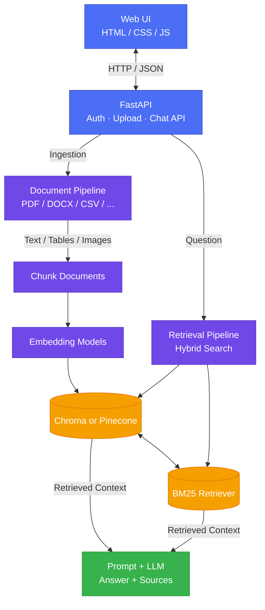
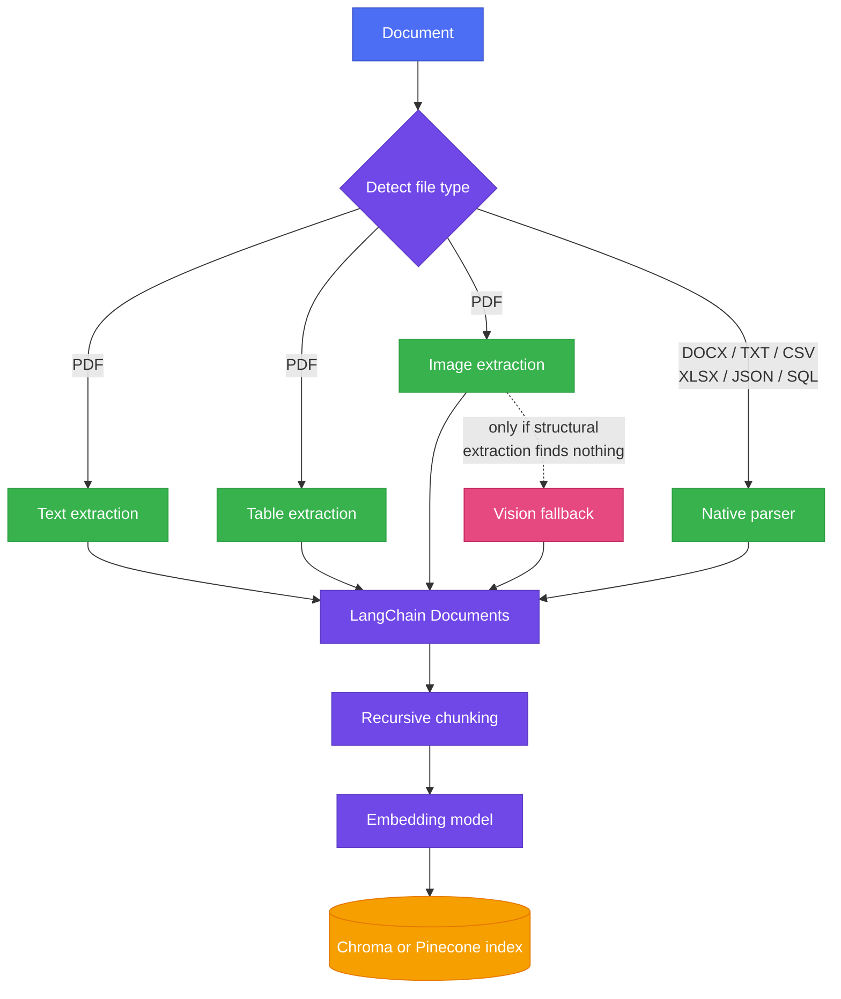
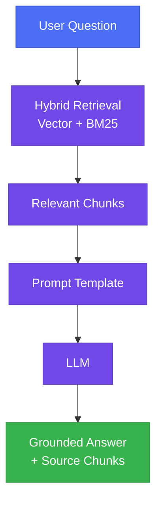
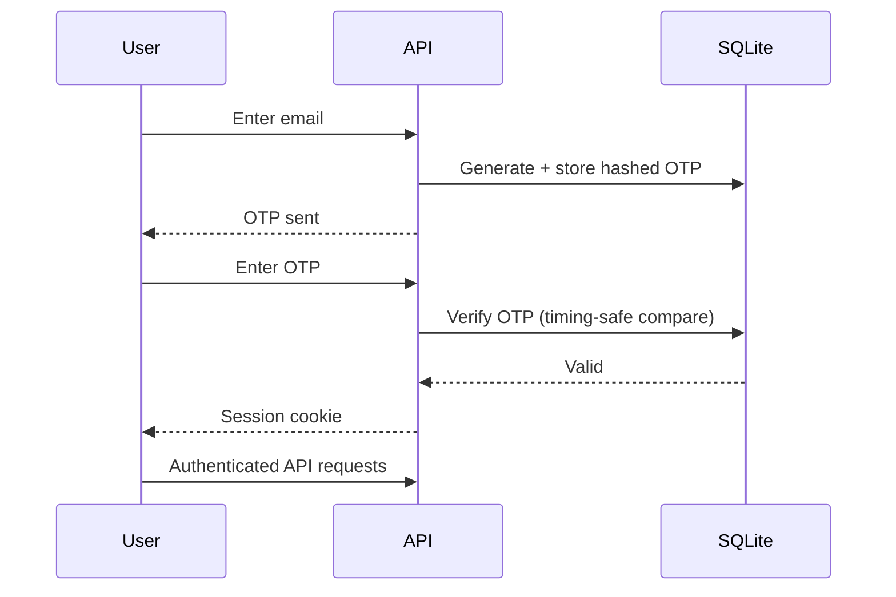

# Document Portal

[](https://github.com/Narang-Garima/document-portal/actions/workflows/ci.yml)
[](https://www.python.org/)

Document Portal is a production-oriented RAG system that turns PDFs, Word files, spreadsheets, structured files, and SQL databases into searchable knowledge. It focuses on the difficult parts of document AI: mixed-content extraction, retrieval quality, model portability, evaluation, and authenticated access.

The default local backend is Chroma. An existing Pinecone serverless index can be selected for managed vector storage. Authentication uses SQLite-backed users and one-time codes.

## Why Document Portal exists

Most RAG tutorials assume a clean PDF with normal tables and no images. Real documents aren't like that — academic papers have borderless tables and vector-drawn charts, spreadsheets have merged cells, and a lot of useful information lives in a table row or a chart, not a paragraph. I wanted to build something that handled that mess honestly: try the fast, free extraction method first, and only fall back to something expensive (a vision model reading the whole page) when the fast method actually fails — verified against a real academic paper, not just a synthetic test file.

## What it does

- Ingests PDF, DOCX, TXT, MD, CSV, JSON, XLSX, and any SQL database through one entry point
- Extracts tables and images from PDFs, with a vision-model fallback for borderless tables and vector-drawn charts that structural parsing misses
- Chunks, embeds, and indexes content in Chroma or Pinecone, tagged by content type (text/table/image)
- Retrieves using hybrid search (vector + BM25 keyword), auto-weighted per document based on how jargon-heavy the content is
- Answers questions grounded in retrieved context, with sources shown alongside the answer
- Supports optional OTP-based login with hashed, expiring, single-use codes and basic roles
- Includes automated API, ingestion, retrieval, authentication, and evaluation tests

## Architecture

### High-level system



### Ingestion pipeline



### Retrieval (RAG)



### Authentication



## Engineering decisions

- **Cascading extraction, not always-vision**: structural methods (pdfplumber, PyMuPDF) run first because they're fast and free. Vision fallback only triggers when structural extraction finds nothing on a page that demonstrably has visual content — avoids paying for an LLM call on every page when most pages don't need it.
- **Provider registries, not a hardcoded model**: embeddings and chat models are pluggable across Hugging Face, OpenAI, Google, Cohere, and Anthropic. Vector storage can use local Chroma or an existing Pinecone index.
- **Embedding/vector-store consistency is enforced, not assumed**: querying a store with a different embedding model than the one that built it silently returns meaningless similarity scores. A sidecar metadata file records what built the store and validates against it at query time — fails loudly instead of failing silently.
- **Hybrid search over pure vector search**: embeddings blur exact terms — IDs, citations, technical jargon — that keyword search catches directly. The balance between the two is auto-tuned per document using a lexical-diversity heuristic, not fixed.
- **DeepEval gated behind explicit opt-in**: judge-model calls cost real API credits, so the RAG-quality suite doesn't run on every commit — only when deliberately triggered (pre-push locally, or in CI with a configured key).

## Stack

- FastAPI backend with health, upload, chat, comparison, administration, and evaluation endpoints
- HTML/CSS/JS frontend (no framework)
- LangChain for chunking, prompts, and caching; Chroma or Pinecone for vectors; BM25 for keyword search
- pdfplumber and PyMuPDF for structural extraction; Gemini for vision fallback and image captioning
- SQLite for auth; Chroma persisted to disk for vectors
- pytest unit/integration tests and an opt-in DeepEval 10-case RAG quality suite
- GitHub Actions and pre-commit hooks for CI

## Run locally

```
git clone https://github.com/Narang-Garima/document-portal.git
cd document-portal
python -m venv .venv
.venv\Scripts\Activate.ps1
pip install -e ".[dev]"
```

Create `.env` with your keys:

```
ANTHROPIC_API_KEY=
GOOGLE_API_KEY=
ADMIN_EMAIL=
SESSION_SECRET=
AUTH_ENABLED=false
ENABLE_DEV_ADMIN_LOGIN=false
OTP_DEBUG=false
```

Run it:

```
uvicorn api.main:app --reload --host 127.0.0.1 --port 8000
```

Open http://127.0.0.1:8000.

### Use Pinecone instead of Chroma

Create a Pinecone index whose dimension matches the configured embedding model. For example, `sentence-transformers/all-MiniLM-L6-v2` produces 384-dimensional embeddings. Install the optional integration and set:

```powershell
pip install -e ".[dev,pinecone]"
$env:VECTOR_STORE_PROVIDER="pinecone"
$env:PINECONE_API_KEY="..."
$env:PINECONE_INDEX_NAME="document-portal"
$env:PINECONE_NAMESPACE="default"
```

Pinecone stores the dense vectors. The current hybrid-search implementation still persists raw chunks locally to construct its BM25 index.

## Validate

```
pytest tests -v
```

Run the paid RAG-quality suite (requires `GOOGLE_API_KEY`):

```
python scripts/run_deepeval.py
```

## Known limitations

- Vision fallback for undetected tables/charts is PDF-only — DOCX extraction is structural-only
- No automatic retry on LLM rate limits — fails gracefully, doesn't auto-retry
- Hybrid search weighting is a heuristic, not a tuned model
- Free-tier vector store persistence may be ephemeral on some hosts (Render free tier) — a redeploy can require re-indexing
- Pinecone hybrid mode still requires shared durable storage for the BM25 chunk corpus in a multi-instance deployment
- Authentication is optional and disabled unless `AUTH_ENABLED=true`; the development admin fallback must be disabled in production
- Production deployments should add enterprise identity, document-level authorization, rate limiting, and centralized tracing

## License

MIT License — see [LICENSE](LICENSE) for details.

